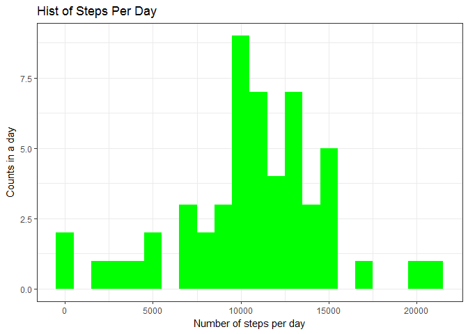
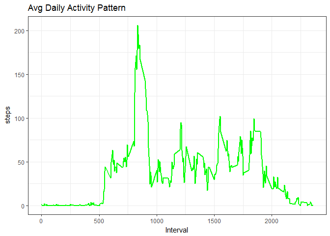
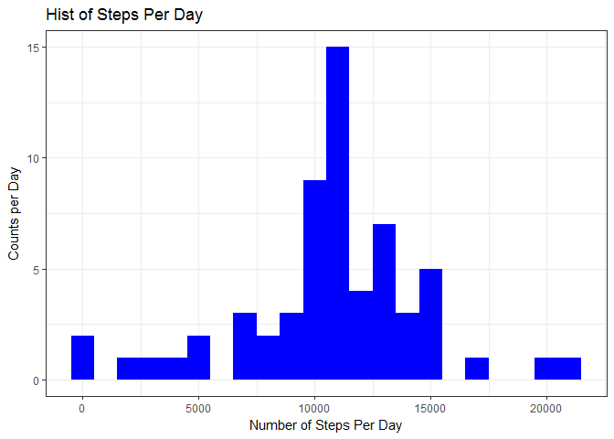
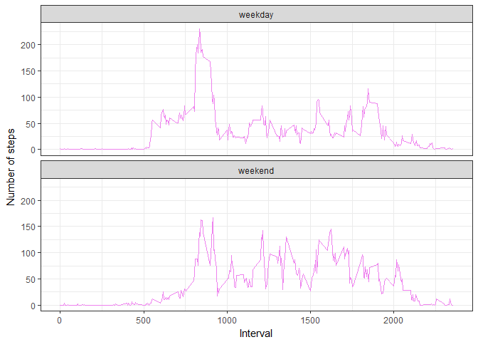

# PA1_template_1
Bobby kimble  
May 11, 2017  
---
title: "PA1_Template"
author: "Bobby kimble"
date: "May 10, 2017"
output: 
  html_document: 
    keep_md: yes
---
---
title: "RR_Peer_Assign_1"
author: "Bobby kimble"
date: "May 8, 2017"
output: html_document
---


```r
library(data.table)
library(ggplot2)
```

```
## Warning: package 'ggplot2' was built under R version 3.3.2
```

1. Load the data (i.e. read.csv())
2. Process/transform the data (if necessary) into a format suitable for your analysis


```r
activity <- read.csv('activity.csv')
activity$date <- as.Date(activity$date, format = '%Y-%m-%d')
activity$interval <- as.factor(activity$interval)
str(activity)
```

```
## 'data.frame':	17568 obs. of  3 variables:
##  $ steps   : int  NA NA NA NA NA NA NA NA NA NA ...
##  $ date    : Date, format: "2012-10-01" "2012-10-01" ...
##  $ interval: Factor w/ 288 levels "0","5","10","15",..: 1 2 3 4 5 6 7 8 9 10 ...
```

1. Calculate the total number of steps taken per day
2. If you do not understand the difference between a histogram and a barplot, research the difference between them. Make a histogram of the total number of steps taken each day


```r
steps_per_day <- aggregate(steps ~ date, activity, sum)
colnames(steps_per_day) <- c('date', 'steps')
ggplot(steps_per_day, aes(x = steps)) + geom_histogram(fill = 'green', binwidth = 1000) + labs(title='Hist of Steps Per Day', x = 'Number of steps per day', y = 'Counts in a day') + theme_bw()
```

<!-- -->

3. Calculate and report the mean and median of the total number of steps taken per day


```r
steps_mean <- mean(steps_per_day$steps, na.rm=TRUE)
steps_median <- median(steps_per_day$steps, na.rm=TRUE)
steps_mean
steps_median
```

```
## [1] 10766.19
## [1] 10765
```

What is the average daily activity pattern?

Make a time series plot (i.e. type = "l") of the 5-minute interval (x-axis) and the average number of steps taken, averaged across all days (y-axis)


```r
steps_per_interval <- aggregate(activity$steps, by = list(interval = activity$interval), FUN = mean, na.rm=TRUE)
steps_per_interval$interval <- as.integer(levels(steps_per_interval$interval)[steps_per_interval$interval])
colnames(steps_per_interval) <- c('interval', 'steps')
ggplot(steps_per_interval, aes(x=interval, y=steps)) + geom_line(color='green', size=1) + labs(title='Avg Daily Activity Pattern', x='Interval', 'Number of Steps') + theme_bw()
```

<!-- -->

Which 5-minute interval, on average across all the days in the dataset, contains the maximum number of steps?


```r
max_interval <- steps_per_interval[which.max(steps_per_interval$steps),]
max_interval
```

```
##     interval    steps
## 104      835 206.1698
```

Note that there are a number of days/intervals where there are missing values (coded as NA). The presence of missing days may introduce bias into some calculations or summaries of the data.

Calculate and report the total number of missing values in the dataset (i.e. the total number of rows with NAs)


```r
missing_vals <- sum(is.na(activity$steps))
missing_vals
```

```
## [1] 2304
```

1. Devise a strategy for filling in all of the missing values in the dataset. The strategy does not need to be sophisticated. For example, you could use the mean/median for that day, or the mean for that 5-minute interval, etc.

2. Create a new dataset that is equal to the original dataset but with the missing data filled in.

3. Make a histogram of the total number of steps taken each day and Calculate and report the mean and median total number of steps taken per day. Do these values differ from the estimates from the first part of the assignment? What is the impact of imputing missing data on the estimates of the total daily number of steps?


```r
na_fill <- function(data, pervalue) {
     na_index <- which(is.na(data$steps))
     na_replace <- unlist(lapply(na_index, FUN=function(idx){
         interval = data[idx,]$interval
         pervalue[pervalue$interval == interval,]$steps
     }))
     fill_steps <- data$steps
     fill_steps[na_index] <- na_replace
     fill_steps
 }

activity_fill <- data.frame(  
     steps = na_fill(activity, steps_per_interval),  
     date = activity$date,  
     interval = activity$interval)
str(activity_fill)
sum(is.na(activity_fill$steps))
fill_steps_per_day <- aggregate(steps ~ date, activity_fill, sum)
colnames(fill_steps_per_day) <- c('date', 'steps')
ggplot(fill_steps_per_day, aes(x = steps)) + geom_histogram(fill = 'blue', binwidth = 1000) + labs(title='Hist of Steps Per Day', x = 'Number of Steps Per Day', y = 'Counts per Day') + theme_bw()
```

<!-- -->

```r
steps_mean_fill <- mean(fill_steps_per_day$steps, na.rm=TRUE)
steps_median_fill <- median(fill_steps_per_day$steps, na.rm=TRUE)
steps_mean_fill
steps_median_fill
```

```
## 'data.frame':	17568 obs. of  3 variables:
##  $ steps   : num  1.717 0.3396 0.1321 0.1509 0.0755 ...
##  $ date    : Date, format: "2012-10-01" "2012-10-01" ...
##  $ interval: Factor w/ 288 levels "0","5","10","15",..: 1 2 3 4 5 6 7 8 9 10 ...
## [1] 0
## [1] 10766.19
## [1] 10766.19
```

1. Create a new factor variable in the dataset with two levels - "weekday" and "weekend" indicating whether a given date is a weekday or weekend day.

2. Make a panel plot containing a time series plot (i.e. type = "l") of the 5-minute interval (x-axis) and the average number of steps taken, averaged across all weekday days or weekend days (y-axis). See the README file in the GitHub repository to see an example of what this plot should look like using simulated data.


```r
weekdays_steps <- function(data) {
     weekdays_steps <- aggregate(data$steps, by=list(interval = data$interval),
                                 FUN=mean, na.rm=T)
     # convert to integers for plotting
     weekdays_steps$interval <- 
         as.integer(levels(weekdays_steps$interval)[weekdays_steps$interval])
     colnames(weekdays_steps) <- c("interval", "steps")
     weekdays_steps
 }
data_by_weekdays <- function(data) {
     data$weekday <- 
         as.factor(weekdays(data$date)) # weekdays
     weekend_data <- subset(data, weekday %in% c("Saturday","Sunday"))
     weekday_data <- subset(data, !weekday %in% c("Saturday","Sunday"))
     
     weekend_steps <- weekdays_steps(weekend_data)
     weekday_steps <- weekdays_steps(weekday_data)
     
     weekend_steps$dayofweek <- rep("weekend", nrow(weekend_steps))
     weekday_steps$dayofweek <- rep("weekday", nrow(weekday_steps))
     
     data_by_weekdays <- rbind(weekend_steps, weekday_steps)
     data_by_weekdays$dayofweek <- as.factor(data_by_weekdays$dayofweek)
     data_by_weekdays
 }
data_weekdays <- data_by_weekdays(activity_fill)
ggplot(data_weekdays, aes(x=interval, y=steps)) + 
     geom_line(color="violet") + 
     facet_wrap(~ dayofweek, nrow=2, ncol=1) +
     labs(x="Interval", y="Number of steps") +
     theme_bw()
```

<!-- -->


                                                         

